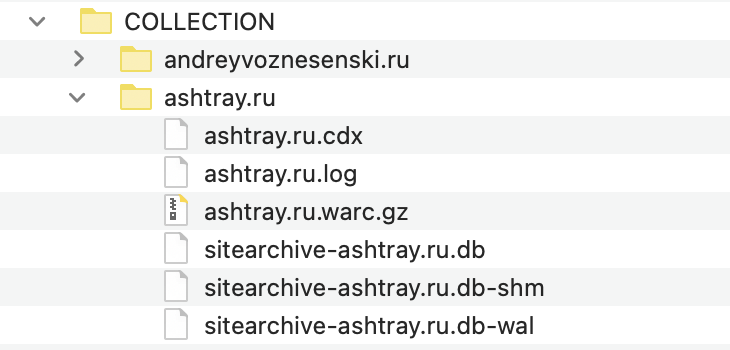
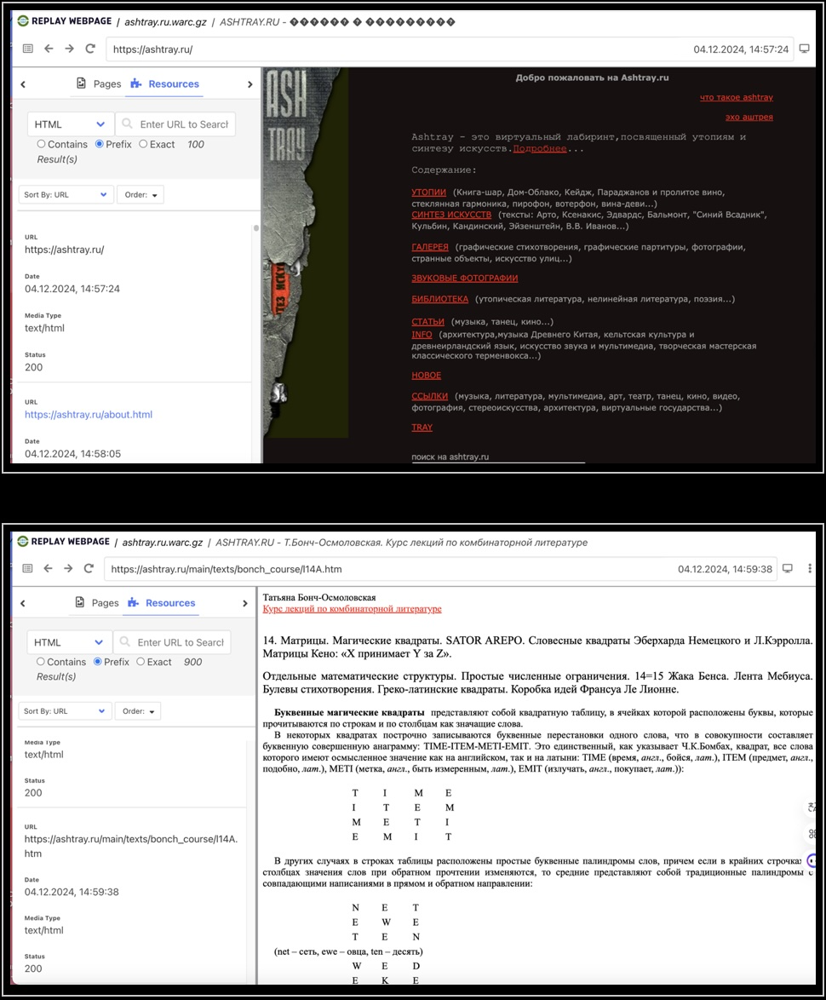
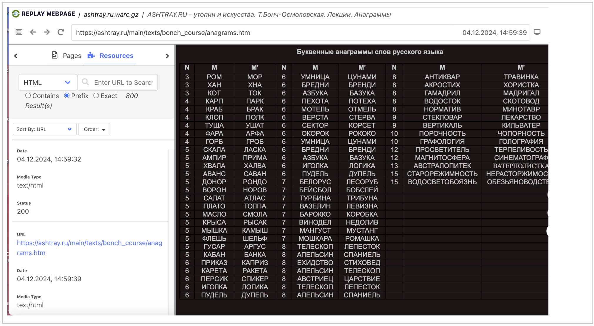
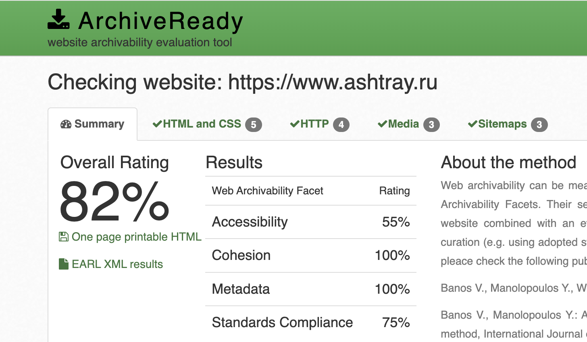

# Архив сайта ashtray.ru

## 1. Работа с wpull

### Описание

Этот раздел содержит результаты архивации сайта с использованием инструмента **wpull**.
В ходе работы использовался скрипт массовой загрузки (см. папку **wpull_mass**) для извлечения коллекции нескольких архивов последовательно. 

### Результаты

Открыв сохранившийся `ashtray.ru.warc.gz` с помощью инструмента просмотра веб-архивов `ReplayWeb.page`, мы можем наблюдать что страницы сайта отлично открываются, материалы доступны для изучения.

## 2. Работа с Archive Ready

### Описание

Этот раздел содержит результаты анализа архивируемости сайта с использованием инструмента Archive Ready. В данном разделе мы пытаемся оценить архив не только с точки зрения постановленной задачи, но также с точки зрения стандартов архивирования в соостветствие в метриками CLEAR.

### Результаты

Рассматривая ресурс с точки зрения стандартных метрик веб-архивирования в `ArchiveReady`, мы можем наблюдать достаточно низкий общий рейтинг.

**Overall Rating (Общий рейтинг) – 82%.** Это хороший показатель, который указывает на то, что сайт имеет неплохой уровень готовности к архивированию.

**Accessibility (Доступность) – 55%.** Не самый высокий результат. Веб-сайт считается архивируемым только в том случае, если веб-краулеры могут посещать его главную страницу, просматривать его содержимое и извлекать его через стандартные HTTP-запросы. В случае если краулер не может найти местоположение всех веб-ресурсов, будет невозможно получить содержимое. Необходимо не только разместить ресурсы на сайте, но и обеспечить надлежащие ссылки, чтобы краулеры могли обнаружить их и извлечь эффективно и результативно. Для поддержки архивируемости веб-сайт, конечно же, должен содержать корректные ссылки.

**Cohesion (Целостность) – 100%.** Отличный результат! Сайт хорошо структурирован и все элементы связаны между собой логично и последовательно. Это важный аспект для успешного архивирования. Целостность важна как для эффективной работы веб-краулеров, так и для управления зависимостями внутри краулеров. Если файлы, составляющие один веб-сайт, разбросаны по разным сервисам (например, разные серверы для изображений, виджетов javascript и других ресурсов), то получение и захват, скорее всего, не будут ни полными, ни точными. Если один из многочисленных сервисов выйдет из строя, то не будет работать и веб-сайт. Здесь мы характеризуем устойчивость сайта по отношению к такого рода сбоям как целостность.

**Metadata (Метаданные) – 100%.** Прекрасный показатель, говорящий о том, что метаданные сайта заполнены качественно. Метаданные помогают правильно индексировать контент и обеспечивают его корректную идентификацию при архивировании. Адекватное предоставление метаданных является постоянной проблемой в рамках цифрового курирования. Отсутствие метаданных снижает способность архива эффективно управлять, организовывать, извлекать и взаимодействовать с контентом, это затрудняет понимание контекста материала.

**Standards Compliance (Соответствие стандартам) – 75%.** Хороший результат, но может указывать на наличие некоторых проблем с соблюдением веб-стандартов. Это может касаться HTML-кода, CSS-стилей или других технических аспектов. Рекомендуется, чтобы цифровые ресурсы быть представлены в известных и прозрачных стандартах. Сами стандарты могут быть проприетарными, но при условии, что они широко приняты и понятны, а также имеют вспомогательные инструменты для проверки и доступа. Прежде всего, стандарт должен поддерживать раскрытие информации, прозрачность, минимальную внешнюю зависимость и отсутствие юридических ограничений в отношении процессов сохранения архива.

[Полный отчет ArchiveReady по ashtray.ru](./AR_ashtray.ru.pdf)

## 3. Работа с MetaWarc

### Описание

В данной работе мы исследовали метаданные архива с помощью `metawarc`, используя несколько функций этой утилиты:
- analyze
- metadata

### Описание работы

1. `metawarc analyze ashtray.ru.warc.gz`
<pre>
mimes                            files       size          share
-----------------------------  -------  ---------  -------------
audio/mpeg                          90  367549973   50.8896
audio/x-ms-wma                      20  113830804   15.7606
image/jpeg                        1741   86966998   12.0411
image/gif                         1101   52213330    7.22927
video/x-ms-wmv                       2   38728698    5.36223
text/html                         2049   30988362    4.29053
video/x-msvideo                      6   15467642    2.14159
application/x-rar-compressed        68    9426552    1.30517
application/zip                      6    3623922    0.501755
audio/x-wav                          2    1925344    0.266576
application/msword                  24    1149650    0.159176
application/x-shockwave-flash        2     360344    0.0498919
application/xml                     22      16378    0.00226764
                                     2       1158    0.000160332
text/plain                           1        338    4.67982e-05
#total                            5136  722249493  100
</pre>

Мы можем видеть, что наибольшую долю на диске занимает видео, аудио и графические файлы, 2 файла не идентифицированны. 

2. `metawarc metadata --filetypes pdf --output ashtray.ru_meta.jsonl ashtray.ru.warc.gz`

Результаты работы команды мы можем пронаблюдать в файле [digital_meta_ashtray.ru.jsonl](./digital_meta_ashtray.ru.jsonl), который содержит всю информацию о метаданных архива.

3. `metawarc index ashtray.ru.warc.gz` - анализируеn «ashtray.ru.warc.gz» и записывает «metawarc.db» с метаданными HTTP.
   `metawarc stats -m mimes` - обрабатывает данные в «metawarc.db» и выводит общую длину и количество для каждого MIME               
┏━━━━━━━━━━━━━━━━━━━━━━━━━━━━━━━━━┳━━━━━━━━━━━┳━━━━━━━┓
┃ mime                            ┃ size      ┃ count ┃
┡━━━━━━━━━━━━━━━━━━━━━━━━━━━━━━━━━╇━━━━━━━━━━━╇━━━━━━━┩
│ None                            │ 1158      │     2 │
│ application/javascript          │ 107431    │     3 │
│ application/msword              │ 1180617   │    25 │
│ application/vnd.ms-fontobject   │ 3797      │     1 │
│ application/x-rar-compressed    │ 9426552   │    68 │
│ application/x-shockwave-flash   │ 360344    │     2 │
│ application/xml                 │ 16378     │    22 │
│ application/zip                 │ 3623922   │     6 │
│ audio/mpeg                      │ 367549973 │    90 │
│ audio/x-ms-wma                  │ 113830804 │    20 │
│ audio/x-wav                     │ 1925344   │     2 │
│ font/ttf                        │ 3612      │     1 │
│ font/woff                       │ 4465      │     1 │
│ image/gif                       │ 52248247  │  1109 │
│ image/jpeg                      │ 90847795  │  1825 │
│ image/png                       │ 1058771   │     2 │
│ text/css                        │ 23022     │     2 │
│ text/html                       │ 28993415  │  1817 │
│ text/html; charset=iso-8859-1   │ 109021    │   226 │
│ text/html; charset=utf-8        │ 2277638   │    14 │
│ text/html; charset=windows-1251 │ 197730    │    20 │
│ text/plain                      │ 338       │     1 │
│ video/mp4                       │ 957667992 │     5 │
│ video/x-ms-wmv                  │ 38728698  │     2 │
│ video/x-msvideo                 │ 15467642  │     6 │
└─────────────────────────────────┴───────────┴───────┘

