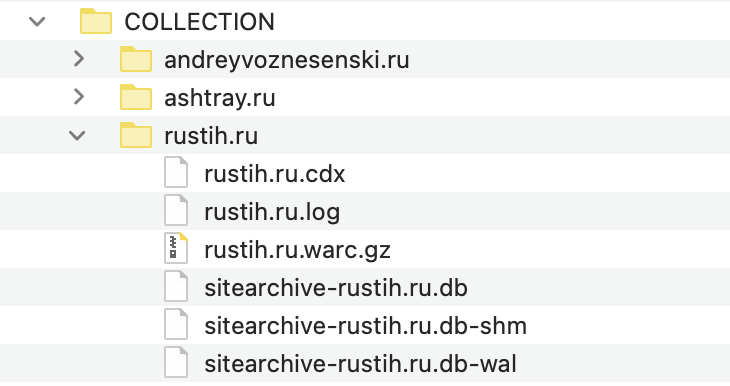
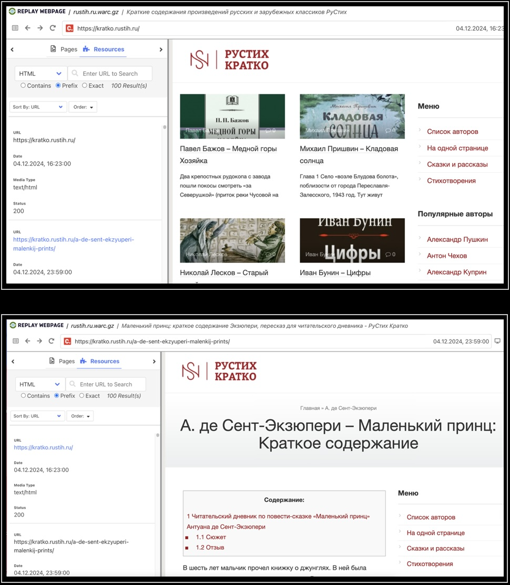
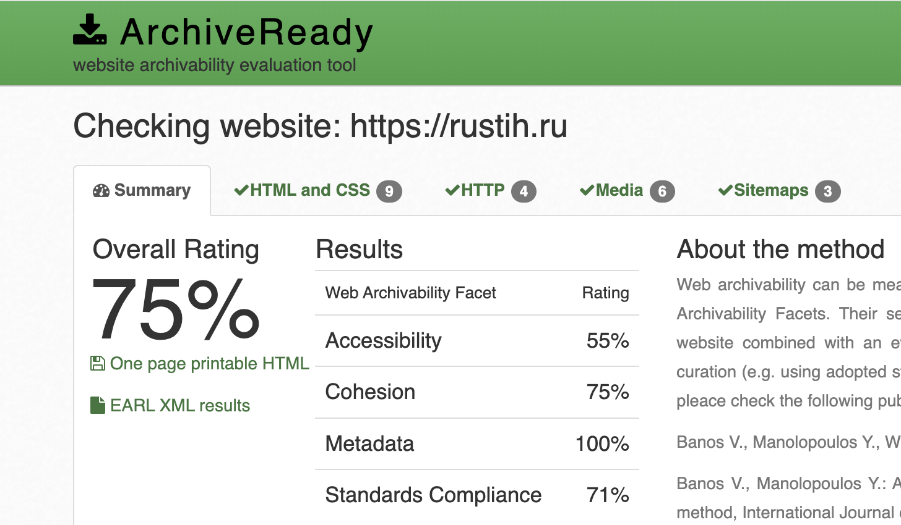

# Архив сайта rustih.ru

## 1. Работа с wpull

### Описание

Этот раздел содержит результаты архивации сайта с использованием инструмента **wpull**.
 

### Результаты

Так как загрузка этого архива была прервана, все материалы сайта отображаться не будут. Открыв сохранившийся `rustih.ru.warc.gz` с помощью инструмента просмотра веб-архивов `ReplayWeb.page`, мы можем наблюдать, что лишь некоторые материалы сайта доступны для ознакомения.

## 2. Работа с Archive Ready

### Описание

Этот раздел содержит результаты анализа архивируемости  сайта с использованием инструмента Archive Ready. В данном разделе мы пытаемся оценить архив не только с точки зрения постановленной задачи, но также с точки зрения стандартов архивирования в соостветствие в метриками CLEAR.

### Результаты

Рассматривая ресурс с точки зрения стандартных метрик веб-архивирования в `ArchiveReady`, мы можем наблюдать не самый высокий общий рейтинг.

**Overall Rating (Общий рейтинг) – 75%.** Это нормальный показатель, который указывает на то, что сайт имеет приемлимый уровень готовности к архивированию.

**Accessibility (Доступность) – 55%.** Довольно низкий результат. Веб-сайт считается архивируемым только в том случае, если веб-краулеры могут посещать его главную страницу, просматривать его содержимое и извлекать его через стандартные HTTP-запросы. В случае если краулер не может найти местоположение всех веб-ресурсов, будет невозможно получить содержимое. Необходимо не только разместить ресурсы на сайте, но и обеспечить надлежащие ссылки, чтобы краулеры могли обнаружить их и извлечь эффективно и результативно. Для поддержки архивируемости веб-сайт, конечно же, должен содержать корректные ссылки.

**Cohesion (Целостность) – 75%.** Нормальный результат! Сайт нелохо структурирован, но, вероятно, не все элементы связаны между собой логично и последовательно. Это важный аспект для успешного архивирования. Целостность важна как для эффективной работы веб-краулеров, так и для управления зависимостями внутри краулеров. Если файлы, составляющие один веб-сайт, разбросаны по разным сервисам (например, разные серверы для изображений, виджетов javascript и других ресурсов), то получение и захват, скорее всего, не будут ни полными, ни точными. Если один из многочисленных сервисов выйдет из строя, то не будет работать и веб-сайт. Здесь мы характеризуем устойчивость сайта по отношению к такого рода сбоям как целостность.

**Metadata (Метаданные) – 100%.** Прекрасный показатель, говорящий о том, что метаданные сайта заполнены достаточно качественно. Они помогают правильно индексировать контент и обеспечивают его корректную идентификацию при архивировании. Адекватное предоставление метаданных является постоянной проблемой в рамках цифрового курирования. Отсутствие метаданных снижает способность архива эффективно управлять, организовывать, извлекать и взаимодействовать с контентом, это затрудняет понимание контекста материала.

**Standards Compliance (Соответствие стандартам) – 71%.** Средний результат, который может указывать на наличие некоторых проблем с соблюдением веб-стандартов. Это может касаться HTML-кода, CSS-стилей или других технических аспектов. Рекомендуется, чтобы цифровые ресурсы быть представлены в известных и прозрачных стандартах. Сами стандарты могут быть проприетарными, но при условии, что они широко приняты и понятны, а также имеют вспомогательные инструменты для проверки и доступа. Прежде всего, стандарт должен поддерживать раскрытие информации, прозрачность, минимальную внешнюю зависимость и отсутствие юридических ограничений в отношении процессов сохранения архива.

[Полный отчет ArchiveReady по rustih.ru](./AR_rustuh.ru.pdf)

## 3. Работа с MetaWarc

### Описание

В данной работе мы исследовали метаданные архива с помощью `metawarc`, используя несколько функций этой утилиты:
- analyze
- metadata

### Описание работы

1. `metawarc analyze rustih.ru.warc.gz`
<pre>
mimes                            files         size          share
-----------------------------  -------  -----------  -------------
text/html                       151483  26983010355   90.2158
audio/mpeg                         766   2783597216    9.30677
image/png                         1334    113006177    0.377828
text/xml                            90     11492096    0.038423
image/jpeg                         570      7067421    0.0236294
image/svg+xml                       22      3742734    0.0125136
text/css                             9      2386981    0.00798071
application/vnd.ms-fontobject       12      1564195    0.00522978
application/javascript              38      1338133    0.00447396
font/ttf                             9      1063641    0.00355621
font/woff                            9       603361    0.0020173
font/woff2                           9       479813    0.00160422
image/gif                           12        32412    0.000108367
image/x-icon                         3         4443    1.48549e-05
text/plain                           2         1572    5.25587e-06
#total                          154368  29909390550  100
</pre>

Мы можем видеть, что наибольшую долю на диске занимает видео и html-страницы. 

2. `metawarc metadata --filetypes  pdf --output digital_meta_rustih.jsonl rustih.ru.warc.gz`

Файл  `jsonl` записывается, но пустой (видимо, на данный момент возможность записи результатов не поддерживается или файл слишком большой).

