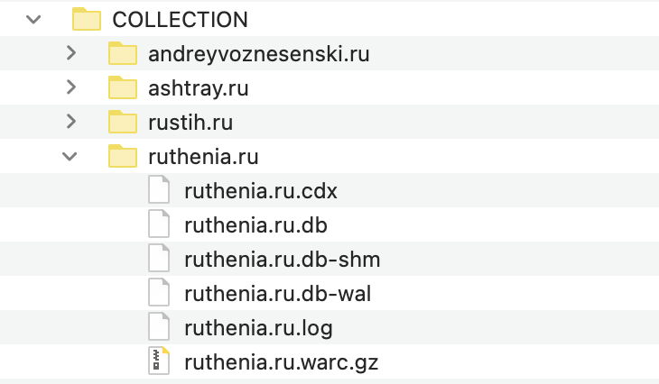
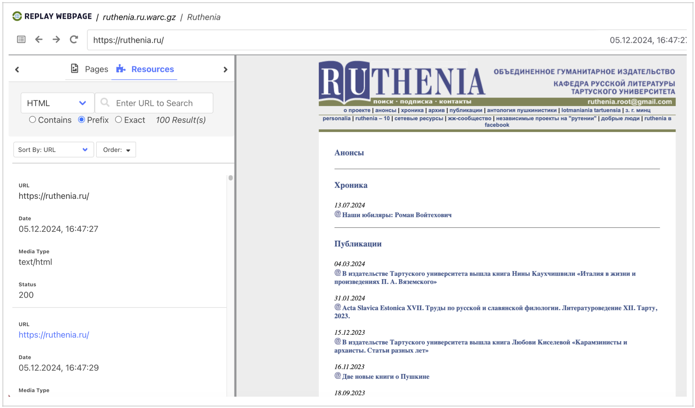
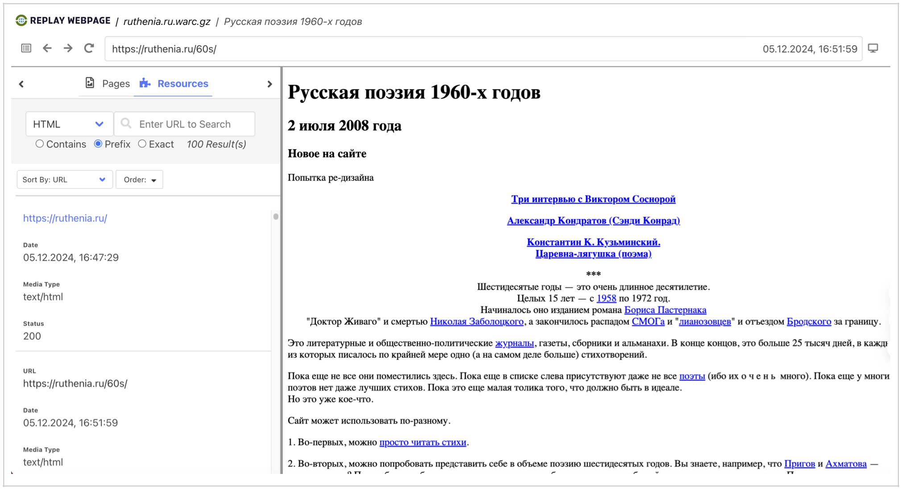
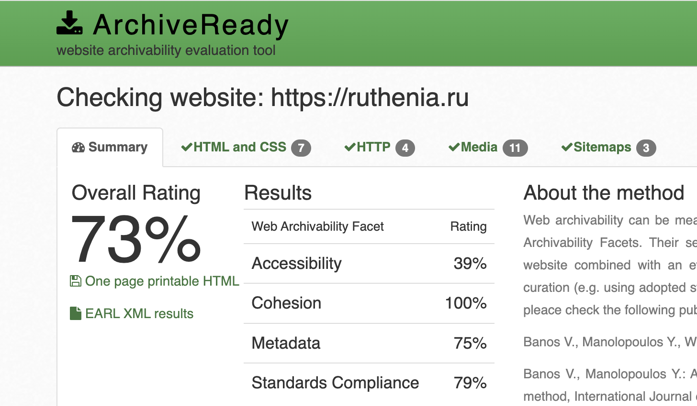

# Архив сайта ruthenia.ru

## 1. Работа с wpull

### Описание

Этот раздел содержит результаты архивации сайта с использованием инструмента **wpull**.

### Результаты

Так как загрузка этого архива была прервана, все материалы сайта отображаться не будут. Открыв сохранившийся `ruthenia.ru.warc.gz` с помощью инструмента просмотра веб-архивов `ReplayWeb.page`, мы можем наблюдать, что главная страница загружается и некоторые материалы сайта доступны для ознакомения. 

## 2. Работа с Archive Ready

### Описание

Этот раздел содержит результаты анализа архивируемости  сайта с использованием инструмента Archive Ready. В данном разделе мы пытаемся оценить архив не только с точки зрения постановленной задачи, но также с точки зрения стандартов архивирования в соостветствие в метриками CLEAR.

### Результаты

Рассматривая ресурс с точки зрения стандартных метрик веб-архивирования в `ArchiveReady`, мы можем наблюдать не самый высокий общий рейтинг.

**Overall Rating (Общий рейтинг) – 73%.** Это средний показатель, который указывает на то, что сайт имеет умеренный уровень готовности к архивированию.

**Accessibility (Доступность) – 39%.** Очень низкий результат. Веб-сайт считается архивируемым только в том случае, если веб-краулеры могут посещать его главную страницу, просматривать его содержимое и извлекать его через стандартные HTTP-запросы. В случае если краулер не может найти местоположение всех веб-ресурсов, будет невозможно получить содержимое. Необходимо не только разместить ресурсы на сайте, но и обеспечить надлежащие ссылки, чтобы краулеры могли обнаружить их и извлечь эффективно и результативно. Для поддержки архивируемости веб-сайт, конечно же, должен содержать корректные ссылки.

**Cohesion (Целостность) – 100%.** Отличный результат! Сайт хорошо структурирован и все элементы связаны между собой логично и последовательно. Это важный аспект для успешного архивирования. Целостность важна как для эффективной работы веб-краулеров, так и для управления зависимостями внутри краулеров. Если файлы, составляющие один веб-сайт, разбросаны по разным сервисам (например, разные серверы для изображений, виджетов javascript и других ресурсов), то получение и захват, скорее всего, не будут ни полными, ни точными. Если один из многочисленных сервисов выйдет из строя, то не будет работать и веб-сайт. Здесь мы характеризуем устойчивость сайта по отношению к такого рода сбоям как целостность.

**Metadata (Метаданные) – 75%.** Нормальный показатель, говорящий о том, что не все метаданные сайта заполнены достаточно качественно. Метаданные помогают правильно индексировать контент и обеспечивают его корректную идентификацию при архивировании. Адекватное предоставление метаданных является постоянной проблемой в рамках цифрового курирования. Отсутствие метаданных снижает способность архива эффективно управлять, организовывать, извлекать и взаимодействовать с контентом, это затрудняет понимание контекста материала.

**Standards Compliance (Соответствие стандартам) – 79%.** Нормальный результат, который может указывать на наличие некоторых проблем с соблюдением веб-стандартов. Это может касаться HTML-кода, CSS-стилей или других технических аспектов. Рекомендуется, чтобы цифровые ресурсы быть представлены в известных и прозрачных стандартах. Сами стандарты могут быть проприетарными, но при условии, что они широко приняты и понятны, а также имеют вспомогательные инструменты для проверки и доступа. Прежде всего, стандарт должен поддерживать раскрытие информации, прозрачность, минимальную внешнюю зависимость и отсутствие юридических ограничений в отношении процессов сохранения архива.

[Полный отчет ArchiveReady по ruthenia.ru](./AR_ruthenia.ru.pdf/)

## 3. Работа с MetaWarc

### Описание

В данной работе мы исследовали метаданные архива с помощью `metawarc`, используя несколько функций этой утилиты:
- analyze
- metadata

### Описание работы

1. `metawarc analyze ruthenia.ru.warc.gz`
<pre>
mimes                                                                      files        size          share
-----------------------------------------------------------------------  -------  ----------  -------------
application/pdf                                                             2430  3607286158   56.2579
text/html                                                                  43105  1358856624   21.1922
audio/mpeg                                                                   420   482021384    7.51742
image/jpeg                                                                  4899   445956861    6.95498
application/javascript                                                        41   223081504    3.4791
application/zip                                                              914    80226297    1.25118
application/octet-stream                                                     643    61849670    0.964584
video/x-msvideo                                                                5    56686378    0.88406
application/msword                                                           373    46474342    0.724796
image/gif                                                                   2269    16789826    0.261848
image/png                                                                     70    10498390    0.163729
application/vnd.openxmlformats-officedocument.wordprocessingml.document       64     6601343    0.102952
application/x-rar-compressed                                                   8     5654705    0.0881887
application/vnd.ms-excel                                                       7     3324804    0.0518524
application/rtf                                                               13     2586904    0.0403444
text/plain                                                                     2     2448156    0.0381805
text/xml                                                                      61     1228885    0.0191652
text/css                                                                      78      255872    0.00399048
application/x-shockwave-flash                                                  3      206286    0.00321716
image/x-icon                                                                   2       20162    0.000314439
#total                                                                     55407  6412054551  100
</pre>

Мы можем видеть, что наибольшую долю на диске занимают pdf, html - фрматы, а также фото и видео. 

2. `metawarc metadata --filetypes  pdf --output digital_meta_ruthenia.jsonl ruthenia.ru.warc.gz`

Файл  `jsonl` записывается, но пустой (видимо, на данный момент возможность записи результатов не поддерживается).

