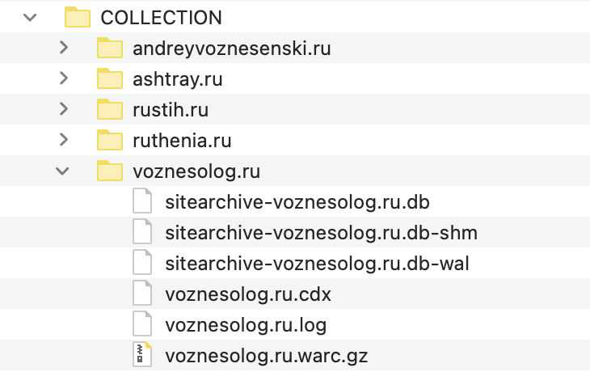
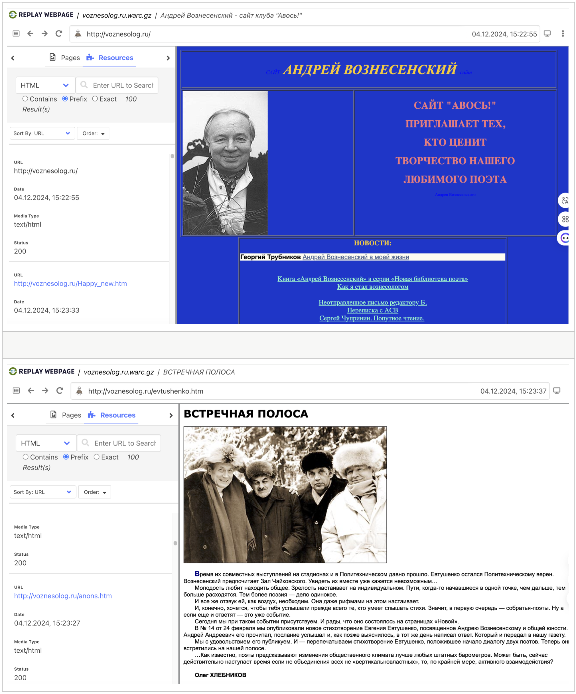
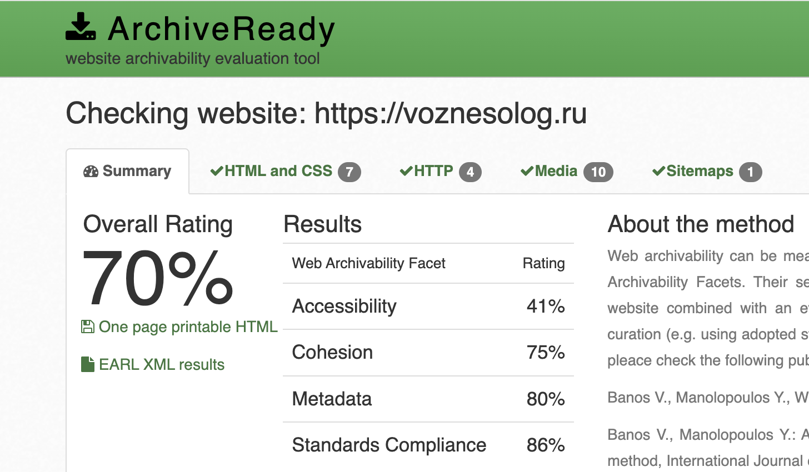

# Архив сайта voznesolog.ru

## 1. Работа с wpull

### Описание

Этот раздел содержит результаты архивации сайта с использованием инструмента **wpull**.
В ходе работы использовался скрипт массовой загрузки (см. папку **wpull_mass**) для извлечения коллекции нескольких архивов последовательно. 

### Результаты

Открыв сохранившийся `voznesolog.ru.warc.gz` с помощью инструмента просмотра веб-архивов `ReplayWeb.page`, мы можем наблюдать что все страницы сайта открываются, весть текст и фото доступны для ознакомления.

## 2. Работа с Archive Ready

### Описание

Этот раздел содержит результаты анализа архивируемости  сайта с использованием инструмента Archive Ready. В данном разделе мы пытаемся оценить архив не только с точки зрения постановленной задачи, но также с точки зрения стандартов архивирования в соостветствие в метриками CLEAR.

### Результаты

Рассматривая ресурс с точки зрения стандартных метрик веб-архивирования в `ArchiveReady`, мы можем наблюдать достаточно низкий общий рейтинг.

**Overall Rating (Общий рейтинг) – 70%.** Это средний показатель, который указывает на то, что сайт имеет умеренный уровень готовности к архивированию.

**Accessibility (Доступность) – 41%.** Очень низкий результат. Веб-сайт считается архивируемым только в том случае, если веб-краулеры могут посещать его главную страницу, просматривать его содержимое и извлекать его через стандартные HTTP-запросы. В случае если краулер не может найти местоположение всех веб-ресурсов, будет невозможно получить содержимое. Необходимо не только разместить ресурсы на сайте, но и обеспечить надлежащие ссылки, чтобы краулеры могли обнаружить их и извлечь эффективно и результативно. Для поддержки архивируемости веб-сайт, конечно же, должен содержать корректные ссылки.

**Cohesion (Целостность) – 75%.** Не самый лучший результат. Сайт структурированне бузупречно, вероятно, не все элементы связаны между собой логично и последовательно. Это важный аспект для успешного архивирования. Целостность важна как для эффективной работы веб-краулеров, так и для управления зависимостями внутри краулеров. Если файлы, составляющие один веб-сайт, разбросаны по разным сервисам (например, разные серверы для изображений, виджетов javascript и других ресурсов), то получение и захват, скорее всего, не будут ни полными, ни точными. Если один из многочисленных сервисов выйдет из строя, то не будет работать и веб-сайт. Здесь мы характеризуем устойчивость сайта по отношению к такого рода сбоям как целостность.

**Metadata (Метаданные) – 80%.** Хороший показатель, говорящий о том, что метаданные сайта заполнены достаточно качественно. Они помогают правильно индексировать контент и обеспечивают его корректную идентификацию при архивировании. Адекватное предоставление метаданных является постоянной проблемой в рамках цифрового курирования. Отсутствие метаданных снижает способность архива эффективно управлять, организовывать, извлекать и взаимодействовать с контентом, это затрудняет понимание контекста материала.

**Standards Compliance (Соответствие стандартам) – 86%.** Хороший результат, возможно наличие некоторых проблем с соблюдением веб-стандартов. Это может касаться HTML-кода, CSS-стилей или других технических аспектов. Рекомендуется, чтобы цифровые ресурсы быть представлены в известных и прозрачных стандартах. Сами стандарты могут быть проприетарными, но при условии, что они широко приняты и понятны, а также имеют вспомогательные инструменты для проверки и доступа. Прежде всего, стандарт должен поддерживать раскрытие информации, прозрачность, минимальную внешнюю зависимость и отсутствие юридических ограничений в отношении процессов сохранения архива.

[Полный отчет ArchiveReady по voznesolog.ru](./AR_voznesolog.ru.pdf)

## 3. Работа с MetaWarc

### Описание

В данной работе мы исследовали метаданные архива с помощью `metawarc`, используя несколько функций этой утилиты:
- analyze
- metadata

### Описание работы

1. `metawarc analyze voznesolog.ru.warc.gz`
<pre>
mimes              files      size        share
---------------  -------  --------  -----------
image/jpeg           728  33496040   55.239
text/html           1364  19781979   32.6228
application/pdf        4   5769700    9.51492
image/gif            254   1372948    2.26415
text/css              12     89802    0.148094
application/xml        1     47430    0.0782177
image/svg+xml          2     44912    0.0740652
application/zip        2     35618    0.0587383
#total              2367  60638429  100
</pre>

Мы можем видеть какие файлы имеютнаибольшую долю на диске. 

2. `metawarc metadata --output digital_meta_voznesolog.ru.jsonl voznesolog.ru.warc.gz`

Результаты работы команды мы можем пронаблюдать в файле [digital_meta_voznesolog.ru.jsonl](./digital_meta_voznesolog.ru.jsonl), который содержит всю информацию о метаданных архива.

3. `metawarc index voznesolog.ru.warc.gz` - анализируеn «voznesolog.ru.warc.gz» и записывает «metawarc.db» с метаданными HTTP.
   `metawarc stats -m mimes` - обрабатывает данные в «metawarc.db» и выводит общую длину и количество для каждого MIME
<pre>
┏━━━━━━━━━━━━━━━━━━━━━━━━━━━━━━━━━┳━━━━━━━━━━━━┳━━━━━━━┓
┃ mime                            ┃ size       ┃ count ┃
┡━━━━━━━━━━━━━━━━━━━━━━━━━━━━━━━━━╇━━━━━━━━━━━━╇━━━━━━━┩
│ None                            │ 1158       │     2 │
│ application/javascript          │ 214862     │     6 │
│ application/msword              │ 1211584    │    26 │
│ application/pdf                 │ 5769700    │     4 │
│ application/vnd.ms-fontobject   │ 7594       │     2 │
│ application/x-rar-compressed    │ 9426552    │    68 │
│ application/x-shockwave-flash   │ 360344     │     2 │
│ application/xml                 │ 63808      │    23 │
│ application/zip                 │ 3659540    │     8 │
│ audio/mpeg                      │ 367549973  │    90 │
│ audio/x-ms-wma                  │ 113830804  │    20 │
│ audio/x-wav                     │ 1925344    │     2 │
│ font/ttf                        │ 7224       │     2 │
│ font/woff                       │ 8930       │     2 │
│ image/gif                       │ 53656112   │  1371 │
│ image/jpeg                      │ 128224632  │  2637 │
│ image/png                       │ 2117542    │     4 │
│ image/svg+xml                   │ 44912      │     2 │
│ text/css                        │ 135846     │    16 │
│ text/html                       │ 48775394   │  3181 │
│ text/html; charset=iso-8859-1   │ 109021     │   226 │
│ text/html; charset=utf-8        │ 2669350    │    22 │
│ text/html; charset=windows-1251 │ 395460     │    40 │
│ text/plain                      │ 338        │     1 │
│ video/mp4                       │ 1915335984 │    10 │
│ video/x-ms-wmv                  │ 38728698   │     2 │
│ video/x-msvideo                 │ 15467642   │     6 │
└─────────────────────────────────┴────────────┴───────┘
</pre>

