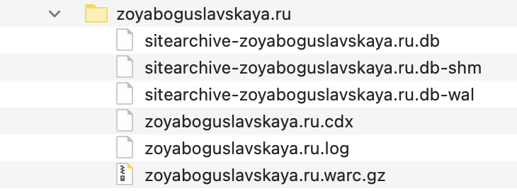
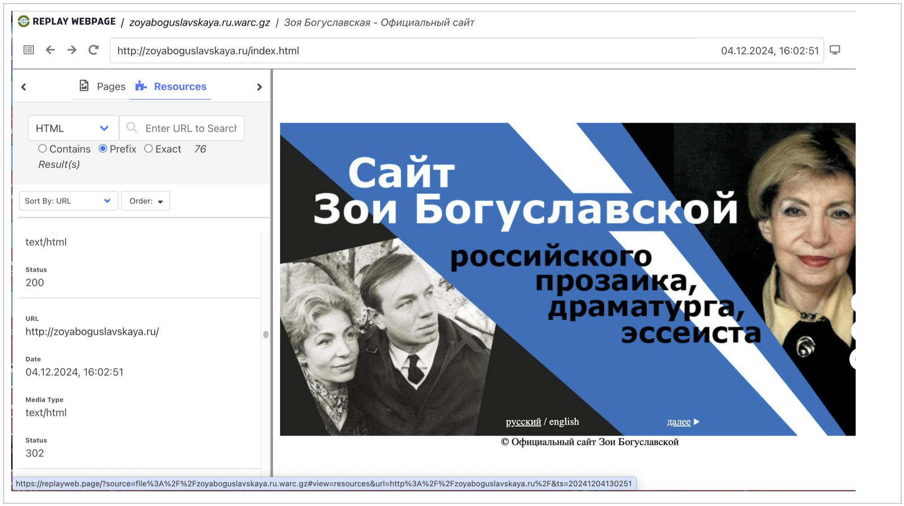
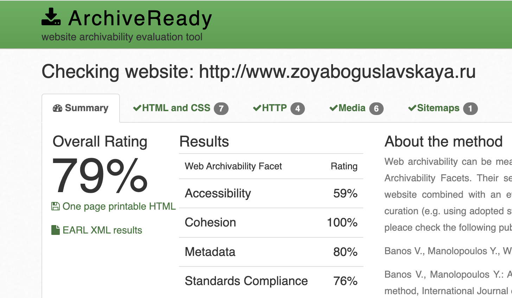

# Архив официального сайта Зои Богуславской zoyaboguslavskaya.ru

## 1. Работа с wpull

### Описание

Этот раздел содержит результаты архивации сайта с использованием инструмента **wpull**.
В ходе работы использовался скрипт массовой загрузки (см. папку **wpull_mass**) для извлечения коллекции нескольких архивов последовательно. 

### Результаты

Открыв сохранившийся архив `zoyaboguslavskaya.ru.warc.gz` с помощью инструмента просмотра веб-архивов `ReplayWeb.page`, мы можем наблюдать что все страницы сайта отображаются, в целом информация доступна для ознакомления, кроме, например, окна с видео передачи канала «Культура».

## 2. Работа с Archive Ready

### Описание

Этот раздел содержит результаты анализа архивируемости сайта с использованием инструмента **Archive Ready**. В данном разделе мы пытаемся оценить архив не только с точки зрения постановленной задачи, но также с точки зрения стандартов архивирования в соостветствие в метриками CLEAR.

### Результаты

Рассматривая ресурс с точки зрения стандартных метрик веб-архивирования в `ArchiveReady`, мы можем наблюдать не самый высокий общий рейтинг архивируемости сайта.

**Overall Rating (Общий рейтинг) – 79%.** Это средний показатель, который указывает на то, что сайт имеет умеренный уровень готовности к архивированию.

**Accessibility (Доступность) – 59%.** Тут у нас средний результат. Вообще, веб-сайт считается архивируемым только в том случае, если веб-краулеры могут посещать его главную страницу, просматривать его содержимое и извлекать его через стандартные HTTP-запросы. В случае если краулер не может найти местоположение всех веб-ресурсов, будет невозможно получить содержимое. Необходимо не только разместить ресурсы на сайте, но и обеспечить надлежащие ссылки, чтобы краулеры могли обнаружить их и извлечь эффективно и результативно. Для поддержки архивируемости веб-сайт, конечно же, должен содержать корректные ссылки.

**Cohesion (Целостность) – 100%.** Отличный результат! Сайт хорошо структурирован и все элементы связаны между собой логично и последовательно. Это важный аспект для успешного архивирования. Целостность важна как для эффективной работы веб-краулеров, так и для управления зависимостями внутри краулеров. Если файлы, составляющие один веб-сайт, разбросаны по разным сервисам (например, разные серверы для изображений, виджетов javascript и других ресурсов), то получение и захват, скорее всего, не будут ни полными, ни точными. Если один из многочисленных сервисов выйдет из строя, то не будет работать и веб-сайт. Здесь мы характеризуем устойчивость сайта по отношению к такого рода сбоям как целостность.

**Metadata (Метаданные) – 80%.** Хороший показатель, говорящий о том, что метаданные сайта заполнены достаточно качественно. Они помогают правильно индексировать контент и обеспечивают его корректную идентификацию при архивировании. Адекватное предоставление метаданных является постоянной проблемой в рамках цифрового курирования. Отсутствие метаданных снижает способность архива эффективно управлять, организовывать, извлекать и взаимодействовать с контентом, это затрудняет понимание контекста материала.

**Standards Compliance (Соответствие стандартам) – 76%.** Нормальный результат, который может указывать на наличие некоторых проблем с соблюдением веб-стандартов. Это может касаться HTML-кода, CSS-стилей или других технических аспектов. Рекомендуется, чтобы цифровые ресурсы быть представлены в известных и прозрачных стандартах. Сами стандарты могут быть проприетарными, но при условии, что они широко приняты и понятны, а также имеют вспомогательные инструменты для проверки и доступа. Прежде всего, стандарт должен поддерживать раскрытие информации, прозрачность, минимальную внешнюю зависимость и отсутствие юридических ограничений в отношении процессов сохранения архива.

[Полный отчет ArchiveReady по zoyaboguslavskaya.ru](./AR_zoyaboguslavskaya.ru.pdf)

## 3. Работа с MetaWarc

### Описание

В данной работе мы исследовали метаданные архива с помощью `metawarc`, используя несколько функций этой утилиты:
- analyze
- metadata

### Описание работы

1. `metawarc analyze zoyaboguslavskaya.ru.warc.gz`
<pre>
mimes                            files      size        share
-----------------------------  -------  --------  -----------
image/jpeg                         110   9006232   83.2554
text/html                           76   1433200   13.2488
application/javascript               4    123914    1.14549
application/x-shockwave-flash        2    116060    1.07288
image/gif                           17     75353    0.696578
application/msword                   2     59886    0.553598
text/css                             2      2950    0.0272704
#total                             213  10817595  100
</pre>

Мы можем видеть, что наибольшую долю на диске занимают jpeg-изображения (фотографии). 

2. `metawarc metadata --output digital_meta.jsonl zoyaboguslavskaya.ru.warc.gz`

Результаты работы команды мы можем пронаблюдать в файле [digital_meta_zoyaboguslavskaya.jsonl](./digital_meta_zoyaboguslavskaya.ru.jsonl)

